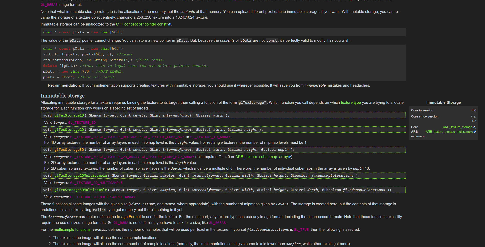

# Khronos OpenGL Wiki Dark Theme
Dark theme designed for the OpenGL reference hosted by Khronos at [www.khronos.org/opengl/wiki](https://www.khronos.org/opengl/wiki).

# Installation
Install Stylus for [Firefox](https://addons.mozilla.org/en-US/firefox/addon/styl-us/), [Chrome](https://chrome.google.com/webstore/detail/stylus/clngdbkpkpeebahjckkjfobafhncgmne) or [Opera](https://addons.opera.com/en-gb/extensions/details/stylus/) and then [install the usercss](https://raw.githubusercontent.com/kociap/Dark-Theme-Collection/master/Khronos%20OpenGL%20Wiki/khronos_opengl_wiki.user.css).

# Screenshots

